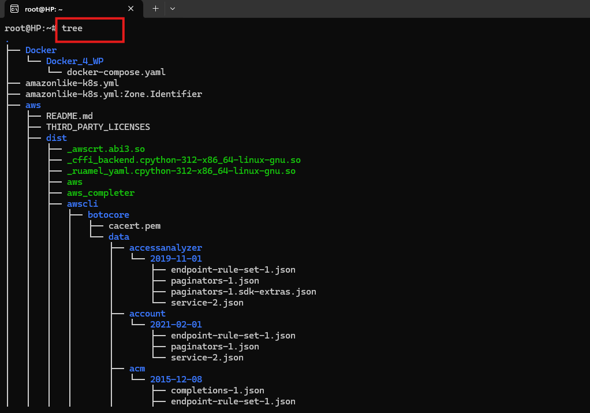

# Mini Project - Linux Fundamentals

## Step 1: Create an AWS Instance (Linux Server - Ubuntu)
- **Log in** to your AWS account.
- Navigate to **EC2 Dashboard**.
- Click on **Launch Instance** and select **Ubuntu** as the OS.
- Configure instance details, storage, security group, and launch it.


## Step 2: Connect to the Server Using PEM Key
- Open **Git Bash** on your local machine.
- Navigate to the directory containing the downloaded `.pem` key:
 ```bash
  cd ~/Downloads
```
## Step 3: Connect to the instance using SSH:
```bash
    ssh -i my-key.pem ubuntu@3.84.42.252
```


## Step 4: Updating Package List
### Update the package list to ensure you have the latest package information:
``` bash
sudo apt update
```

### This command fetches updates for installed packages and dependencies.

## Step 5: Installing a Package (Tree)

### Install the tree package to display directories as a tree structure:
``` bash
sudo apt install tree
```

### Confirm installation by running:
``` bash
tree
```

## Step 6: Verifying Installed Packages

### Check that the tree package is installed correctly by listing directory contents:
``` bash
tree ~/Downloads
```

*You should see a hierarchical representation of your directory.*

## Step 7: Upgrading Installed Packages

### Upgrade installed packages to their latest versions:
``` bash
sudo apt upgrade
```

*This ensures all installed software is up-to-date.*

## Step 8: Removing a Package (Tree)

### Uninstall the tree package:
``` bash
sudo apt remove tree
```
